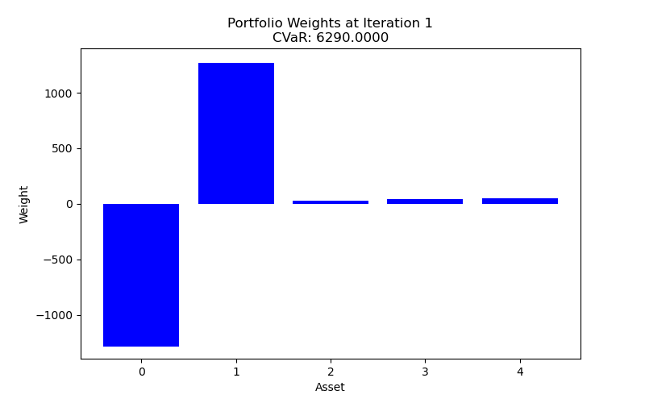
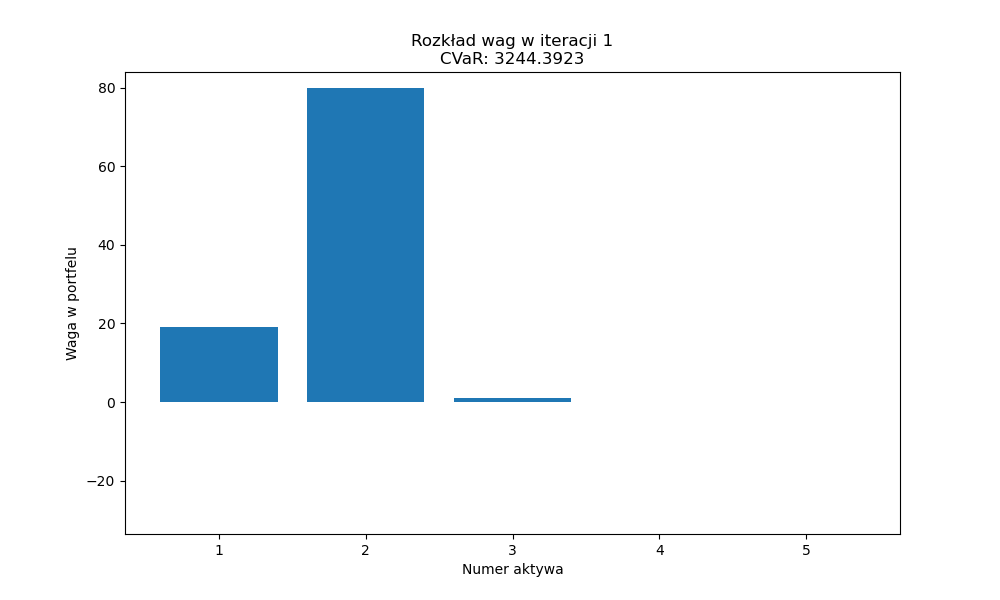

# Optymalizacja portfela akcji
## Minimalizacja ryzyka z ograniczeniem stopy zwrotu
Julia Kruk, Michał Piechota, Gaspar Sekula

---
## Agenda
1. Ryzyko 
2. Ryzyko w finansach
3. Metody minimalizacji ryzyka
4. Metoda CVaR
5. Analiza metody CVaR
6. Wnioski

---

# Ryzyko

**Ryzyko** to możliwość wystąpienia nieoczekiwanych zdarzeń, które mogą negatywnie wpłynąć na realizację celów osoby fizycznej, firmy lub instytucji. W ujęciu finansowym oznacza to niepewność co do przyszłych wyników finansowych, zwłaszcza możliwość poniesienia strat.


---
## Rodzaje ryzyka

1. **Ryzyko finansowe** – związane z utratą środków pieniężnych.
2. **Ryzyko operacyjne** – wynikające z błędów systemów, ludzi lub procesów.
3. **Ryzyko strategiczne** – związane z błędnymi decyzjami zarządczymi.
4. **Ryzyko prawne** – wynikające z nieprzestrzegania przepisów prawa.
5. **Ryzyko rynkowe** – zmiany cen, kursów walut, stóp procentowych.
6. **Ryzyko reputacyjne** – utrata zaufania klientów lub interesariuszy.

---

# Metody minimalizacji ryzyka

| Metoda                     | Opis                                                                 |
|-----------------------------------|----------------------------------------------------------------------|
| **Unikanie ryzyka**        | Rezygnacja z działań niosących wysokie ryzyko.                       |
| **Redukcja ryzyka**        | Wprowadzanie środków ograniczających prawdopodobieństwo strat.      |
| **Przeniesienie ryzyka**   | Przekazanie ryzyka stronie trzeciej (np. przez ubezpieczenie).       |
| **Akceptacja ryzyka**      | Świadome podjęcie ryzyka, jeśli jest ono niewielkie.                |
| **Dywersyfikacja**         | Rozproszenie ryzyka między różne działania/inwestycje.              |
| **Monitoring, kontrola**  | Stałe śledzenie ryzyk i reagowanie na zmiany.                        |

---
# Metody analizy ryzyka wynikające z matematyki finansowej
W matematyce finansowej istnieje wiele metod i narzędzi służących ilościowej analizie ryzyka oraz jego minimalizacji. 

---

###  1. Model Markowitza (Mean-Variance Optimization)

* Teoria portfela Markowitza pozwala dobrać aktywa tak, aby zminimalizować wariancję (tj. ryzyko) przy zadanej oczekiwanej stopie zwrotu.
* Cel: Optymalne zrównoważenie ryzyka i zysku.
* Metoda:

  $$
  \text{Minimalizacja wariancji portfela: } \sigma_p^2 = \mathbf{w}^\top \Sigma \mathbf{w}
  $$

  gdzie:
  $\mathbf{w}$ – wektor wag aktywów,
  $\Sigma$ – macierz kowariancji zwrotów aktywów.
* Zastosowanie: dobór portfela inwestycyjnego.

---

### 2. Value at Risk (VaR)

* Miara ryzyka mówiąca, ile można maksymalnie stracić z określonym prawdopodobieństwem w danym horyzoncie czasowym.
* „VaR na poziomie 95% wynosi 100 000 zł” – oznacza, że z 95% pewnością strata nie przekroczy tej kwoty.
* Metody wyznaczania VaR: np. historyczna symulacja lub Monte Carlo.


### **3. Conditional Value at Risk (CVaR / Expected Shortfall)**

* Średnia strata, gdy już wystąpi strata przekraczająca VaR.
* Lepsza kontrola ryzyka w „ogonie rozkładu”. Dlaczego? - szczegóły w kolejnych rozdziałach.


---

### 4. Delta-hedging

* Zabezpieczanie portfela opcyjnego przez odpowiednią pozycję w instrumencie bazowym.
* Wykorzystuje wzory z modelu Blacka-Scholesa.
* Delta opcji mówi, ile akcji trzeba kupić/sprzedać, aby zneutralizować zmianę ceny opcji (czyli aby zmiana wyceny instrumentu bazowego nie wpłynęła na wartość portfela).

---

### 5. Model Black-Scholes i pochodne modele opcyjne

* Wycenianie opcji i strategii zabezpieczających wykorzystując model Blacka-Scholesa.

### 6. Teoria miar spójnych ryzyka (Coherent Risk Measures)

* Zbiór właściwości, które powinna spełniać dobra miara ryzyka (np. CVaR spełnia te warunki, VaR nie zawsze).
* Aksjomaty miary spójnej: monotoniczność, subaddytywność, translacyjność, jednorodność.

---

### 7. Model CAPM (Capital Asset Pricing Model)

* Model wyceny aktywów uwzględniający ryzyko systematyczne (β).
* Wzór:

  $$
  E(R_i) = R_f + \beta_i (E(R_m) - R_f)
  $$

  gdzie:
  $R_f$ – stopa wolna od ryzyka (np. stopa zwrotu z papierów skarbowych),
  $\beta_i$ – współczynnik ryzyka (określający kowariancję stopy zwrotu danego papieru wartościowego ze stopą zwrotu z portfela rynkowego),
  $E(R_m)$ – oczekiwany zwrot z rynku.
* Cel: określenie, czy aktywo jest odpowiednio wycenione względem jego ryzyka.


---

# Metoda CVaR

---

**Cel projektu:**
Znaleźć portfel $x \in \mathbb{R}^n$ który:
1. Minimalizuje ryzyko (CVaR)
2. Osiąga oczekiwaną stopę zwrotu $r_e$

---

## Podstawowe definicje

**Wartość portfela:**
$$
V_t(x) = \sum_{i=1}^n x_i S_i[t], \quad t \in \{0,T\}
$$

**Stopa zwrotu:**
$$
R_T(x) = \frac{V_T(x) - V_0(x)}{V_0(x)}
$$

**Strata portfela:**
$$
L_T(x) = -(V_T(x) - V_0(x))
$$

---

## Miary ryzyka

### Value-at-Risk (VaR)
$$
\text{VaR}_\alpha(x) = \inf\{z \in \mathbb{R} : \mathbb{P}(L_T(x) > z) \leq 1 - \alpha\}
$$

### Conditional VaR (CVaR)
$$
\text{CVaR}_\alpha(x) = \mathbb{E}(L_T(x)|L_T(x) > \text{VaR}_\alpha(x))
$$

**Alternatywna formuła:**
$$
\text{CVaR}_\alpha(x) = \min_{\beta \in \mathbb{R}}\left\{\beta + \frac{\mathbb{E}(L_T(x) - \beta)^+}{1 - \alpha}\right\}
$$

---

## Problem optymalizacyjny

**Dla modelu dyskretnego:**
$$
\min_{(\beta,x)}\left\{\beta + \frac{1}{1-\alpha}\sum_{j=1}^m p_j(x^\top(s_j-S_0)-\beta)^+\right\}
$$

**Przy ograniczeniach:**
1. $x^\top S_0 = V_0$
2. $\frac{1}{V_0}\sum_{j=1}^m p_j x^\top(s_j-S_0) = r_e$

---

## Rozwiązanie problemu

1. **Przekształcenie ograniczeń** do postaci:
$$
Bx = c, \quad \text{gdzie} \quad B = \begin{bmatrix}
S_0^\top \\
\left(\sum_{j=0}^{m} p_j(s_j-S_0) - r_e S_0\right)^\top
\end{bmatrix}, \quad c = \begin{bmatrix} V_0 \\ 0 \end{bmatrix}
$$

2. **Redukcja macierzy** do postaci schodkowej:
$$
\widehat{B}x = \widehat{c}
$$

3. **Rozwiązanie ogólne**:
$$
x_k \text{ dowolne dla } k \geq 3
$$
$$
x_1, x_2 \text{ wyliczane z równań}
$$

---

## Implementacja algorytmu

1. Generacja scenariuszy cen akcji $S_T(w_j) = s_j$
2. Konstrukcja macierzy $B$ i wektora $c$
3. Redukcja do postaci schodkowej $[\widehat{B}|\widehat{c}]$
4. Optymalizacja z użyciem algorytmu symulowanego wyżarzania


---
## Symulowane wyżarzanie

### Opis Algorytmu

Simulated Annealing to probabilistyczny algorytm metaheurystyczny inspirowany procesem wyżarzania w metalurgii. Służy do znajdowania przybliżonych rozwiązań problemów optymalizacyjnych.

**Główne kroki algorytmu:**
1. **Inicjalizacja**:
   - Wybierz początkową konfigurację (rozwiązanie) `x`
   - Ustaw początkową temperaturę `T`
   - Określ maksymalną liczbę iteracji `max_iter`

---
2. **Główna pętla**:
   ```python
   for iteration in range(max_iter):
       # Generuj sąsiednie rozwiązanie
       x_new = generate_neighbor(x)
       
       # Oblicz zmianę funkcji celu
       delta_E = evaluate(x_new) - evaluate(x)
       
       # Akceptuj lepsze rozwiązanie
       if delta_E < 0:
           x = x_new
       else:
           # Akceptuj gorsze rozwiązanie z pewnym prawdopodobieństwem
           p = exp(-delta_E / current_T)
           if random() < p:
               x = x_new
       
       # Aktualizuj temperaturę
       current_T = _annealing_schedule(T, iteration)

---
## Harmonogram chłodzenia 

Temperatura w iteracji `i` obliczana jest według wzoru:

$$
T_i = T_0 \cdot \left( \alpha - 0.2 \cdot \frac{i}{N} \right)
$$

Gdzie:
- $T_0$ - temperatura początkowa
- $\alpha$ - `annealing_rate` (parametr modelu)
- $N$ - `max_iter` (liczba iteracji)
- $i$ - `iteration` (numer aktualnej iteracji)


---
## Harmonogram chłodzenia 


--- 
# Analiza metody CVaR

---

## Jak tworzyć scenariusze?

### 1. Losowanie scenariusza (akcje nieskorelowane)
Dodajemy możliwość generowania scenariuszy zmiany cen akcji. Cena akcji wówczas  $S_T = \alpha S_0$, gdzie $\alpha$ oznacza:
- spadek: $\alpha \sim \mathcal{N}(0.6, 0.1)$  
- brak zmiany: $\alpha \sim \mathcal{N}(1, 0.1)$  
- wzrost: $\alpha \sim \mathcal{N}(1.4, 0.1)$  

Wybór współczynnika $\alpha$ odbywa się losowo z powyższych rozkładów z prawdopodobieństwami $[0.1, 0.8, 0.1]$. 

---
### 2. Losowanie scenariusza (akcje skorelowane)

Losowanie zmiennych normalnych skorelowanych. Rózne akcje mają różne zmienności (wariancje zmiany). Losowanie odbywa się w oparciu o model lognormalny: $S_T = e^\alpha S_0$, gdzie $\alpha \sim \mathcal{N}(\mu - 0.5\sigma^2, \sigma^2)$, gdzie $\mu$ przybliża oczekiwaną stopę zwrotu.


### 3. Scenariusze oparte o badanie rynku w poprzednich latach
Analizujemy trajektorie giełdowe akcji 3 firm i na tej podstawie wyznaczamy współczynnik $\alpha$ ($S_T = \alpha S_0$).


---

## Ścieżki optymalizacji dla sztucznie wygenerowanych danych


---

## Ścieżki optymalizacji dla scenariuszy ze skorelowanymi akcjami


---

## Ścieżki optymalizacji dla danych wygenerowanych na prawdziwych szeregach giełdowych


---

## Wpływ portfela początkowego na wynik

Badamy wpływ punktu startowego $x_0$ na wynik optymalizacji ($S_0$, $S_T$ bez zmian).


| Nr | Portfel początkowy         | Portfel optymalny           | CVaR / V0   |
|----|----------------------------|-----------------------------|-------------|
| 1  | [10 20 30 40 50]           | [ 30  64  12  21 -27]       | 0.292647    |
| 2  | [ 5 15 25 35 45]           | [ 27  64  20  17 -28]       | 0.292920    |
| 3  | [20 30 40 50 60]           | [ 31  64  10  22 -27]       | 0.293088    |
| 4  | [  0   0   0   0 100]      | [ 30  67   3  21 -21]       | 0.293893    |
| 5  | [100 100 100 100 100]      | [ 31  65  10  19 -25]       | 0.292636    |
| 6  | [1000 10 1000 0 1]         | [-113 -23 671 -179 -256]    | 3.080822    |

---

## Losowość metody

Na poniższym wykresie znajduje się 7 ścieżek optymalzacji dla tych samych wartości początkowych $x$.


---
## Wpływ prawdopodobieństw scenariuszy na CVaR

Przeprowadzono 10 eksperymentów (10 razy optymalizowano) z 1000 możliwych scenariuszy (tzn. $S_T = (S_T^1,...,S_T^{1000}$), gdy scenariusze są jednakowo prawdopodobne i gdy nie są.

| Nr | Rozkład prawdopodobieństw | Średnia CVaR | Odchylenie std CVaR |
|----|--------------------------|--------------|---------------------|
| 0  | niejednostajny           | 0.31         | 5.28819e-05         |
| 1  | jednostajny              | 1.67         | 0.00932323          |

Wybór rozkładu na scenariuszach ma niebagatelne znaczenie dla wyników końcowych (CVaR oraz jego rozrzutu na różnych ścieżkach optymalizacji).

---

## CVaR vs. stopa zwrotu 


---

## Zmiana współrzędnych portfela w procesie optymalizacji

$S_T$ składa się z 5 możliwych scenariuszy, na sztywno ustawionych przez nas, rozkład prawdopodobieństw scenariuszy jest jednostajny.



---

## Zmiana współrzędnych portfela w procesie optymalizacji

$S_T$ składa się z 1000 możliwych losowanych scenariuszy, rozkład prawdopodobieństw scenariuszy jest niejednostajny (prawdopodobieństwo rośnie wraz z numerem scenariusza).



---

## Zmiana współrzędnych portfela w procesie optymalizacji

$S_T$ składa się z 1000 możliwych scenariuszy powstałych z danych historycznych, rozkład prawdopodobieństw scenariuszy jest niejednostajny (prawdopodobieństwo rośnie wraz z numerem scenariusza).


---

## Regularyzacja L2


---

## Liczba scenariuszy a stabilność metody

Badamy wpływ liczby scenariuszy $(10^2,...,10^6)$ na rozrzut wartości CVaR w powtarzanych testach.

---
Estymowane wartości CVaR normalizujemy przez maksymalną w danym eksperymencie i badamy rozrzut wartości. Na podstawie wykresów poniżej wnioskujemy, że im większa liczba scenariuszy, tym stabilniejsze wyniki.


---
Analizujemy odchylenie standardowe i różnicę między największą i najmniejszą wartością CVaR w eksperymencie.


---
#### Wyniki z eksperymentów

| Liczba scenariuszy | Odchylenie std | Max - Min  |
|--------------------|----------------|------------|
| 100                | 0.008143       | 0.020650   |
| 1 000              | 0.001053       | 0.002935   |
| 10 000             | 0.000804       | 0.002071   |
| 100 000            | 0.000321       | 0.000905   |
| 1 000 000          | 0.000129       | 0.000299   |

---

# Wnioski

1. Stabilność metody CVaR rośnie wraz z liczbą scenariuszy
2. Portfel początkowy ma duże znaczenie dla zbieżności metody.
3. Rozkład prawdopodobieństw na przestrzeni scenariuszy ma znaczenie dla wartości CVaR i stabilności metody.
4. Metoda jest niedeterministyczna, więc dla tych samych parametrów może zbiegać do różnych minimów.

---
## Literatura

- Jorion, P. *Value at Risk*. McGraw-Hill, 2007.  
- Hull, J.C. *Options, Futures, and Other Derivatives*. Pearson, 2022.  
- Żebrowska-Suchodolska, D. *Matematyka finansowa w zastosowaniach*, PWN, 2021.  
- ISO 31000:2018 – [https://www.iso.org/iso-31000-risk-management.html](https://www.iso.org/iso-31000-risk-management.html)
- Wikipedia, *Delta neutralny* – [https://pl.wikipedia.org/wiki/Delta_neutralny](https://pl.wikipedia.org/wiki/Delta_neutralny)
- Wikipedia, *Value at Risk – Computation methods* – [https://en.wikipedia.org/wiki/Value_at_risk#Computation_methods](https://en.wikipedia.org/wiki/Value_at_risk#Computation_methods)
- Wikipedia, *Coherent risk measure* – [https://en.wikipedia.org/wiki/Coherent_risk_measure](https://en.wikipedia.org/wiki/Coherent_risk_measure)
- Wikipedia, *Capital Asset Pricing Model* – [https://pl.wikipedia.org/wiki/Capital_Asset_Pricing_Model](https://pl.wikipedia.org/wiki/Capital_Asset_Pricing_Model)

